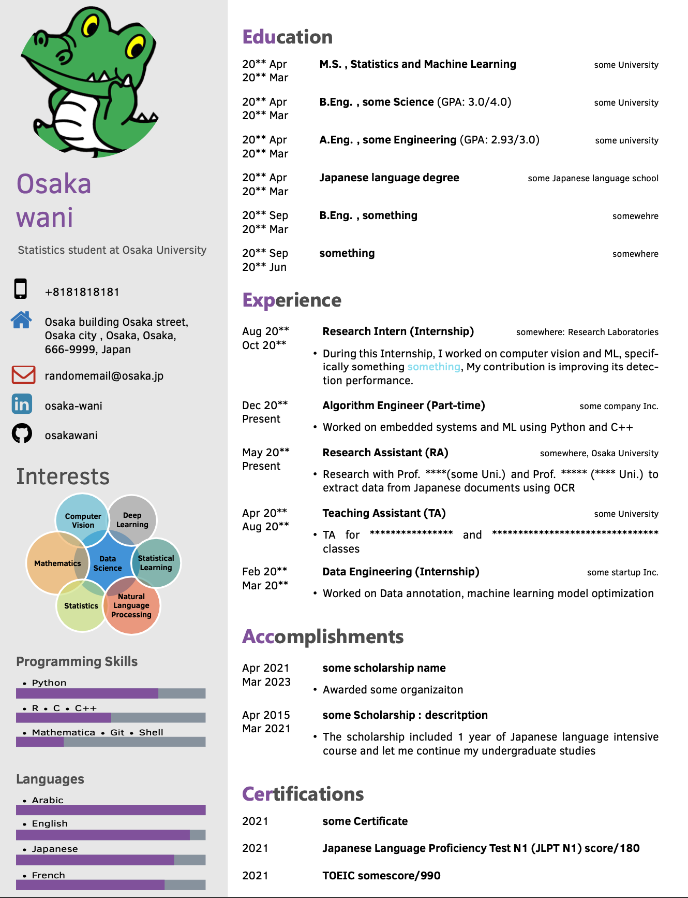

# Machine-Learning-resume-template
## A resume template in Latex
### This template is a simplified version of:
1. [Muhammed Buyukkinaci's resume template ](https://github.com/MuhammedBuyukkinaci/Data-Scientist-LaTeX-Resume-with-Photo)
### Heavily inspired by:
2. [Latexstudio's Data engineer Resume template](https://github.com/latexstudio/Data-Engineer-Resume-LaTeX) 

### You can run this code on [overleaf](https://www.overleaf.com/) and modify it to your wish 
All you need to do is download the repository, zip the folder [My resume_2022](https://github.com/codgas/Machine-Learning-resume-template/tree/main/My%20resume_2022) and upload to overleaf as a new project

***

***
